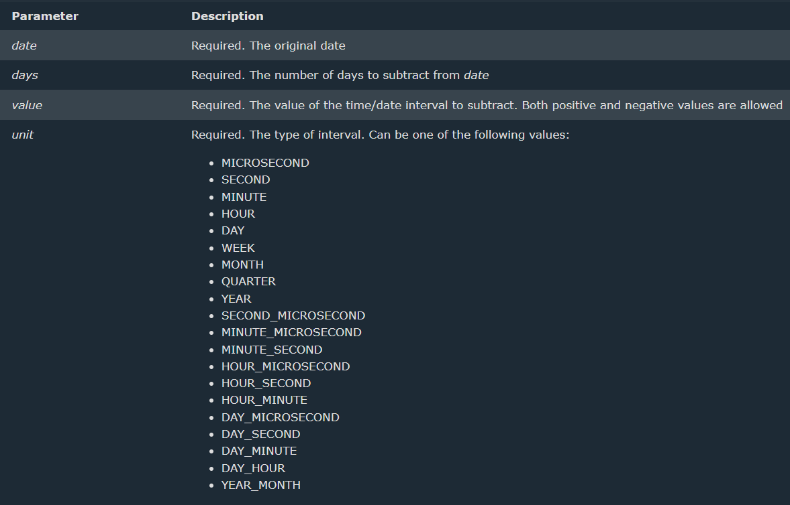

> # Date & Time Functions in MySql

> 1. ADDDATE
```
SELECT ADDDATE("2003-04-11", INTERVAL 10 DAY)  # 2003-04-21
```
> 2. CURDATE
```
SELECT CURDATE() # Returns the current date
```

> 3. DATE
```
SELECT DATE("2003-04-11 11:09:00")  # 2003-04-11
```

> 4. DATEDIFF
```
SELECT DATEDIFF("2003-04-11", "2003-04-13")  # -2
```

> 5. SUBDATE
```
SELECT SUBDATE("2003-04-11", INTERVAL 10 DAY) # 2003-04-01
```


> 6. EXTRACT
```
SELECT EXTRACT(DAY FROM "2003-04-11")  # 11
```


> 7. DAYNAME
```
SELECT DAYNAME("2003-04-11")  # Friday
```

> 8. MONTHNAME
```
SELECT MONTHNAME("2003-04-11")  # April
```

> 9. LAST_DAY
```
SELECT LAST_DAY("2003-04-11")  # 2003-04-30
```